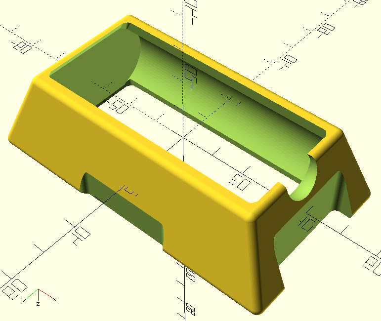

# HDZero-Goggle-dual-21700-tray
Dual 21700 battery tray for the HDZero Goggle Battery strap.

This model allows for a 2s 21700 battery back to fit securely into the HDZero Goggle battery straps. Note this was designed for RadioMaster's "21700 5000mAh Battery" with leads that exit the pack at one side of one end between the two cells.

Use [OpenSCAD](https://openscad.org/) to reder the .scad file and export to STL for your slicer.

I printed in TPU with 15% infill and no supports.

I am still considering some changes. Primarily in regard to lead exit.
